* Table of contents. This line is required to start the list.
{:toc}

# User Guide #

# Concepts #

The following section introduces the terms used within Spinnaker. 

## Application-Centric Cloud Model ##

Spinnaker helps simplify cloud deployment by associating cloud objects with applications and projects.  

An **application** is the most atomic unit of deployment in Spinnaker. It represents a deployable that you would normally organize into a cloud image, container or similar mechanism. 

Cloud objects such as load balancers, security groups and autoscaling server groups are all organized under an individual application. Spinnaker enforces the naming conventions from Frigga, which help easily associate a cloud object with it's corresponding application.  

Spinnaker lets you group several applications into **projects**. One application can be tracked by several projects.  The project dashboard in Spinnaker provides a bird's-eye view that helps you distill interesting information across different applications in one place.

If configured properly, Spinnaker is able to manage resources in multiple **accounts** across multiple **cloud providers**. For example, you might want to create an account for sensitive billing information and one for general use. 

Additionally, you can group different clusters within your application across a **stack**. For a given application or set of applications, you might want to have a development, staging and production stack. 

## Execution Model ##

Spinnaker provides two distinct mechanisms to orchestrate your cloud deployments. 

A **task** is what happens when you make a change directly via the Spinnaker UI or by calling the API. For example, when you create a new application in the infrastructure screen or resize a server group in the clusters screen, a new task is created and tracked. 

A **pipeline** allows you to organize more complex cloud deployment instructions in a set of repeatable, automated **stages**.  Pipelines can be kicked off by hand, or listen to events from external sources like Jenkins via automated **triggers**. Spinnaker keeps track of pipeline **executions**, which are records of what happens each time a pipeline runs. 

# Managing Applications #

This section describes how to manage and configure applications in Spinnaker.

## Creating an application ##

To create a new application, 

1. make sure you're on the infrastructure section of Spinnaker and select Actions -> Create Application.
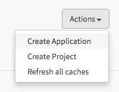

1. Fill in the corresponding details for your application in the dialog that pops up.
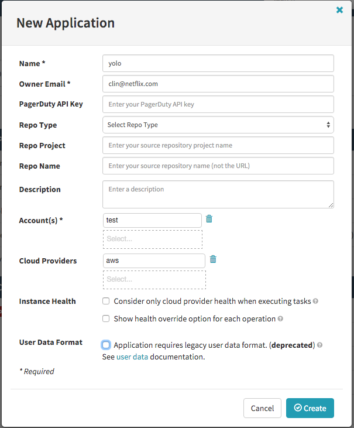

1. Save your changes

Note: your application configuration screen might look differently depending on the way your Spinnaker instance has been configured. 

## Updating application configuration ##

You can change or delete your application settings 

1. Enter the name of your application in the top search bar and select it. 

1. Click on the 'Config' tab 

1. To change your application details, click on 'Edit Application Attributes' and make the changes in the window that pops up. 
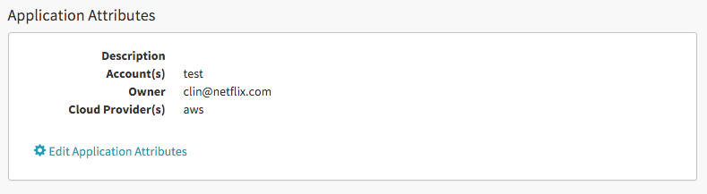

1. To delete your application, scroll to the bottom of the configuration screen and click on "Delete Application". 
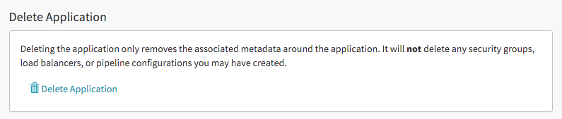
If there are cloud objects associated with your application, you need to delete them first before you can delete the application.

# Project Dashboards #

This section describes how you can make use of the project dashboards in Spinnaker to look at information across applications.

## Creating a project ##

1. To create a project, make sure you're in the infrastructure tab in Spinnaker and select Actions -> create project

1. Give your project a name and owner email
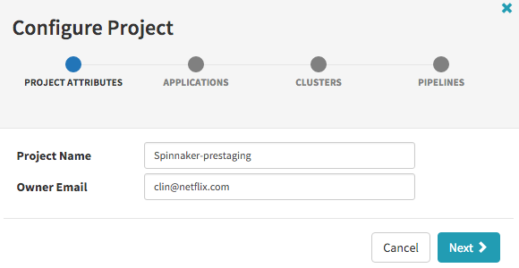

1. Click 'Next' and select the applications you want to incorporate into your project.
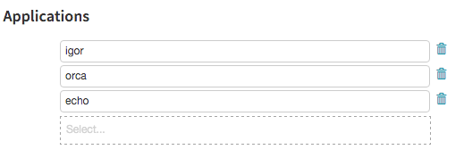

1. Click 'Next' and choose the clusters you want to be displayed in the project dashboard.
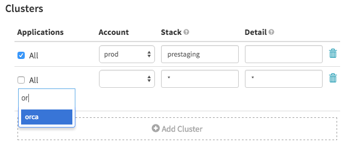
	* You can add more than one cluster by clicking on 'Add Cluster'
	* Use * to mean any stack or detail
	* You can select clusters from individual applications by unchecking the 'All' chechbox.

1. Click 'Next' and choose the pipelines that you wish to monitor.
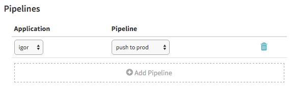
	* You can add more than one pipeline by clicking on 'Add Pipeline'

1. Save your project dashboard.

## Using the project dashboard ##

### Clusters View ###

On the left hand side of the screen, you should see all the clusters that you have defined in your project configuration. You should be able to tell at a glance which build number has been deployed for each application.

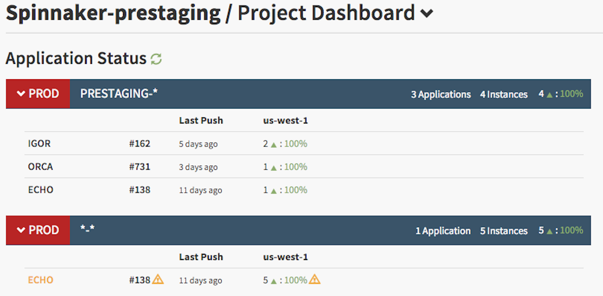

You can mouse over the warning sign to see any mismatches in version numbers within different clusters. 

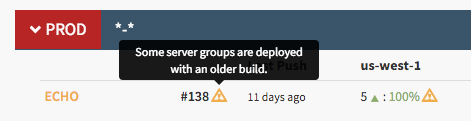

### Pipelines View ###

On the right hand side of the screen, you should see all the pipelines that you have defined in your project configuration and their last execution. This view is helpful to get an idea of the currently executing deployments.

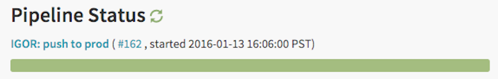

You can click on the pipeline itself to navigate to the pipeline execution within the application.

### Navigating from Projects to Applications ( and back ) ###

The header of the project dashboard allows you to quickly drill into an application and back. 

Simply click on the dropdown and select the application you wish to navigate.

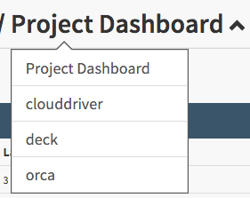

To return to the dashboard, simply click on the 'Project Dashboard' link. 

## Updating your project configuration ##

1. To change the configuration for your project, simply select the 'Project Configuration' button.
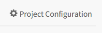

1. To delete your project, click on 'Project Configuration' and then select 'Delete Project'. 
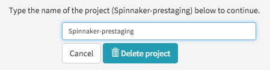

# Working with Cloud Objects #

This section describes how you can use Spinnaker to navigate your resources on the cloud.

## Search ##

## Filtering ##

## Clusters View ##

## Security Groups ##

## Load Balancers ##

## Tasks ##

# Pipelines #

This section shows you how to use deployment pipelines in Spinnaker.

# Using The Spinnaker API #

This section describes how to access and interact with the Spinnaker API. 